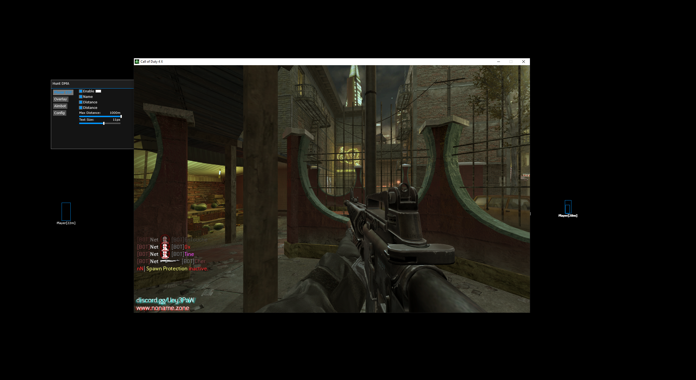
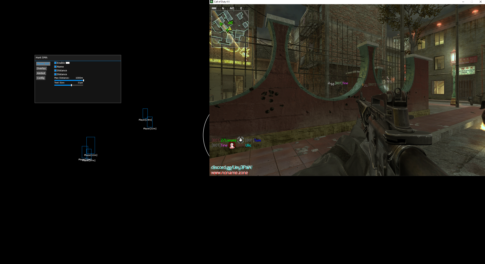

# Cod4 DMA Cheat
A fun little cheat for COD4x.  
There was no reason to do this through PCILeech besides the fact that it was just quick and easy to implement. 

## Showcase

  

## Instructions
* [Installation Guide](./Instructions.md)
 

## Features
* Aimbot
  * Enable
  * Draw FOV
  * FOV
  * Priority
  * AimKey
  * Aimbone
  * Priority
* Player ESP
  * Name
  * Distance
  * Box
  * Box Colour
  * Text Colour
* Overlay
  * Custom Resolution
  * Crosshair
  * Crosshair Mode
  * Crosshair Size
* Config
  * Load
  * Save
## Credits
* [PCILeech](https://github.com/ufrisk/pcileech)
* [MemProcFS](https://github.com/ufrisk/MemProcFS)
* [DMALibrary](https://github.com/Metick/DMALibrary/tree/Master)
